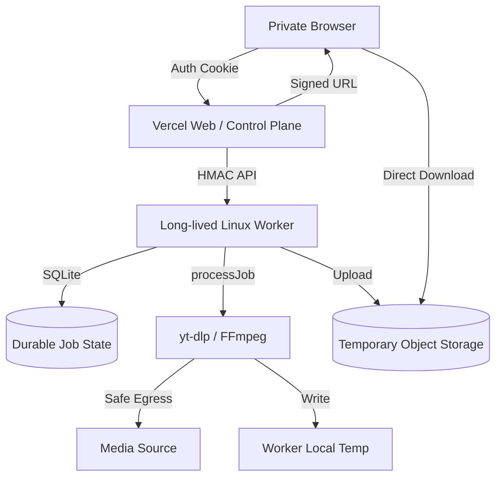
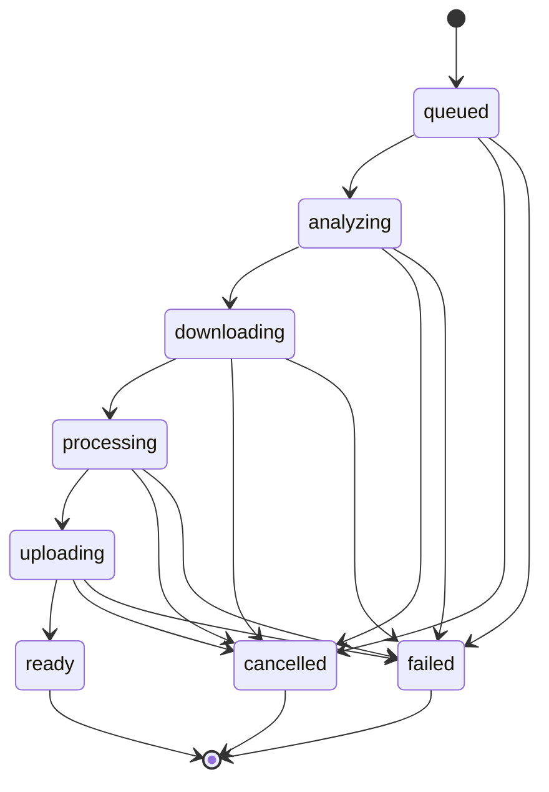

# Worker Execution Boundary and Architecture

## Current Architecture Constraints

Currently, the VideoFetch architecture couples the web control plane and media extraction/processing into a single runtime (designed for Vercel, but currently running as a single Node.js process containing FFmpeg and yt-dlp).

```mermaid
flowchart TD
    Browser[Private Browser] -->|Auth Cookie| Vercel[Web Runtime]
    Vercel -->|In-memory Map| JobStore[In-process Job Store]
    Vercel -->|processJob| Extractor[Extractor / yt-dlp]
    Extractor -->|Network| Source[Media Source]
    Extractor -->|Exec| FFmpeg[FFmpeg]
    FFmpeg -->|Write| TempFS[Local Temp FS]
    Vercel -->|Stream| TempFS
    Browser <--|Download| Vercel
```

## Target Architecture

The target architecture moves all media analysis, downloading, and processing out of the web runtime into a long-lived external worker. The Vercel runtime acts strictly as the web/control plane.



### Trust Boundary

- **Vercel Web Runtime:** Owns user-facing authentication, request schema validation, rate limiting, orchestration, worker request signing (anti-replay), and generating signed object-storage URLs.
- **Worker Runtime:** Owns durable job state, second URL validation, media networking, `yt-dlp`, `FFmpeg`, local temp files, and uploading objects to temporary storage.
- **Worker Egress:** A host/infrastructure-enforced connection-time network boundary entirely prevents private network traversal by yt-dlp/FFmpeg.

## Durable Job State

**Decision:** Worker-local SQLite on a persistent volume.
**Single-Worker Invariant:** The v1 replica count is EXACTLY ONE. Horizontal autoscaling is not supported. The SQLite persistent volume MUST NOT be shared or mounted read/write by multiple worker replicas.
**Why:** The product is private, single-user, and low-concurrency. SQLite provides transactional durability matching the single-worker topology perfectly.

### Job State Machine


**Terminal States:** `ready`, `cancelled`, `failed`.
**Recovery Policy (Conservative):**
- **Queued job on restart:** Remains queued and may resume execution.
- **Running job on restart:** Marked as `failed` with a deterministic worker-restart error. We do NOT automatically restart partially executed network/media work.
- **Ready job:** Remains ready as long as the object exists and hasn't expired.

## Cancellation Contract

Cancellation operates on a strictly deterministic contract:
- **Queued / Running:** Transition to `cancelled`. The `AbortController` triggers SIGKILL, and local temp cleanup runs.
- **Already Cancelled:** Idempotent success (HTTP 200).
- **Ready:** Remains `ready`. Cancellation does NOT delete completed output.
- **Failed:** Remains `failed`.

Object deletion occurs ONLY through expiration cleanup or a future explicit deletion operation. `/cancel` is never overloaded to mean "delete completed object."

## Temporary Storage Model

**Abstraction:** Provider-neutral object storage.
**Object-Key Design:** Opaque and generated server-side. Object keys contain no original URL, no media title, no principal identifier, no user-supplied path segments, and allow no traversal.
Example conceptual form: `videofetch/jobs/<32-hex-job-id>/<random-128-bit-token>`

**Responsibility Split:**
- **Worker (ObjectStoreWriter):** Has credentials to `put`, `head`, and `delete`. The worker DOES NOT sign download URLs.
- **Vercel (ObjectStoreSigner):** Has credentials to `signGet`. Vercel DOES NOT have upload/delete credentials.

**File Delivery Sequence:**
1. Browser calls `GET /api/download/:jobId/file`.
2. Vercel performs private-access authorization.
3. Vercel requests `WorkerJobView` from the Worker.
4. Vercel verifies status == `ready` and not `expired`.
5. Vercel uses the opaque `objectKey` to generate a very short-lived (e.g., < 5 minutes) signed GET URL.
6. **Content-Disposition Guarantee:** `signGet(...)` MUST ensure the final storage response uses the safe, intended Content-Disposition header. This is achieved via signed response-header overrides or immutable safe object metadata set during upload.
7. Vercel issues a 302/303 redirect.
8. Browser downloads directly from Object Storage.

## Analysis and Processing Ownership

| Current Module | Current Responsibility | Future Owner | Reason |
| :--- | :--- | :--- | :--- |
| `src/services/extractors/ytdlp.server.ts` | Metadata and download via yt-dlp | Worker | Untrusted network access must run behind the safe-egress boundary. |
| `src/services/downloads/manager.server.ts` | Queue management, job allocation | Split | Vercel orchestrates; Worker handles the durable SQLite queue. |
| `src/services/downloads/processor.server.ts` | End-to-end execution flow | Worker | Worker executes all media handling. |
| `src/services/processing/ffmpeg.server.ts` | FFmpeg remuxing/conversion | Worker | FFmpeg must run in the worker environment. |
| `src/services/temp/files.server.ts` | Local temp file containment | Worker | Vercel will no longer handle local media files. |

## Health and Diagnostics

- **Web Health (`/api/health`):** Unauthenticated, minimal Vercel uptime check. Does not expose worker secrets.
- **Private Diagnostics (`/api/diagnostics`):** Authenticated via user cookie. Proxies status from the worker.

## Secrets Matrix

| Secret | Vercel Owns? | Worker Owns? | Browser Sees? | Purpose |
| :--- | :--- | :--- | :--- | :--- |
| `VIDEOFETCH_ACCESS_SECRET` | YES | NO | NO | User private-access authentication. |
| `WORKER_CONTROL_SECRET` | YES | YES | NO | HMAC signing for Vercel-to-Worker API. |
| Storage Writer Creds | NO | YES | NO | Worker uploads to Object Storage. |
| Storage Signing Creds | YES | NO | NO | Vercel generates signed download URLs. |

## Repository Packaging Strategy

**Proposed Structure:**
```text
src/
  web/         (Vercel runtime: auth, routes, worker-client)
  worker/      (Worker runtime: sqlite, yt-dlp, ffmpeg, api)
  shared/      (Contracts, public DTOs, config schemas)
```
The repository remains a single monorepo.

## Docker Evolution

The current `Dockerfile` contains Node, FFmpeg, Python, and yt-dlp.
**Future Direction:**
- A new `Dockerfile.worker` will be created specifically for the worker runtime.
- Vercel handles the web runtime without needing a custom Docker image.

## Rollback Model

**Fail-closed behavior:**
If the worker is unavailable, Vercel fails closed returning the planned new `WORKER_UNAVAILABLE` code. Production NEVER silently falls back to running `yt-dlp` locally in the Vercel runtime.
