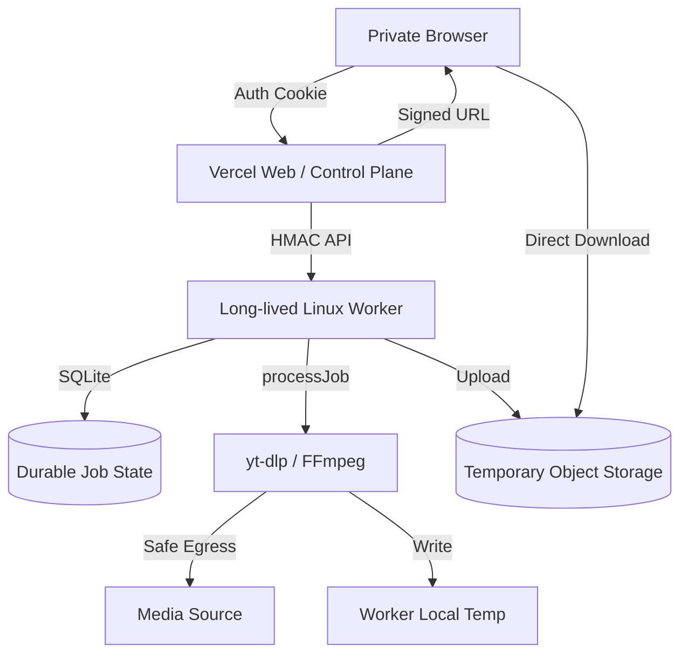
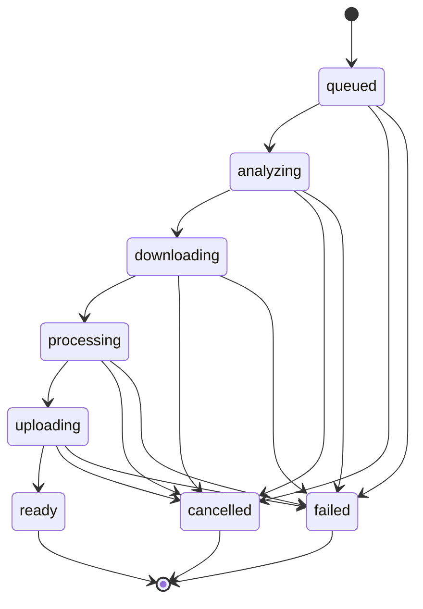

# Worker Execution Boundary and Architecture

## Current Architecture Constraints

Currently, the VideoFetch architecture couples the web control plane and media extraction/processing into a single runtime (designed for Vercel, but currently running as a single Node.js process containing FFmpeg and yt-dlp).

```mermaid
flowchart TD
    Browser[Private Browser] -->|Auth Cookie| Vercel[Web Runtime]
    Vercel -->|In-memory Map| JobStore[In-process Job Store]
    Vercel -->|processJob| Extractor[Extractor / yt-dlp]
    Extractor -->|Network| Source[Media Source]
    Extractor -->|Exec| FFmpeg[FFmpeg]
    FFmpeg -->|Write| TempFS[Local Temp FS]
    Vercel -->|Stream| TempFS
    Browser <--|Download| Vercel
```

**Constraints:**
- Job state is an ephemeral, in-memory `Map`. It vanishes on restart.
- The web runtime directly executes `yt-dlp` and `FFmpeg`.
- Output media files are stored on the local temp filesystem.
- Vercel functions cannot reliably run long-lived FFmpeg processing or store large local temporary media files.

## Target Architecture

The target architecture moves all media analysis, downloading, and processing out of the web runtime into a long-lived external worker. The Vercel runtime acts strictly as the web/control plane.



### Trust Boundary

- **Vercel Web Runtime:** Owns user-facing authentication (private-access cookie), principal identity, request schema validation, rate limiting, orchestration, and worker request signing.
- **Worker Runtime:** Owns durable job state, execution queue, second URL validation, media networking, `yt-dlp`, `FFmpeg`, process lifecycle, local temp files, output upload to object storage, and cleanup.
- **Worker Egress:** A connection-time network boundary entirely prevents private network traversal by yt-dlp/FFmpeg.

## Durable Job State

**Decision:** Worker-local SQLite on a persistent volume.
**Why:** The product is private, single-user, and low-concurrency. Introducing a separate managed database or external Redis cluster introduces unnecessary operational overhead and cost. SQLite provides transactional durability matching the single-worker topology perfectly.
**Rejected alternatives:** Redis (ephemeral/complex), Postgres (overkill for v1 single-user), In-memory (fails on restart).
**Persistence:** The worker must be deployed with a persistent volume containing the SQLite database and temporary processing directories.

### Job State Machine


**Terminal States:** `ready`, `cancelled`, `failed`.
**Recovery Policy (Conservative):**
- **Queued job on restart:** Remains queued and may resume execution.
- **Running job on restart:** Marked as `failed` with a deterministic worker-restart error. We do NOT automatically restart partially executed network/media work to avoid duplicated bandwidth.
- **Ready job:** Remains ready as long as the object exists and hasn't expired.

## Cancellation Contract

**End-to-end flow:**
1. Browser requests cancellation.
2. Vercel validates session, sends signed cancel request to Worker.
3. Worker idempotently updates durable state to `cancelled`.
4. Worker triggers `AbortController`.
5. Process-group termination (SIGKILL) halts yt-dlp/FFmpeg.
6. Local temp cleanup runs.

**Race Conditions:**
- Cancel vs Completion: If already `ready`, cancel fails or acts as a delete.
- Cancel vs Upload: Process aborts, partial object is cleaned up by lifecycle rules.
- Cancel vs Restart: Worker reads `cancelled` state on boot and ignores.

## Temporary Storage Model

**Abstraction:** Provider-neutral object storage.
**Status:** Recommended for implementation (e.g., Cloudflare R2, AWS S3, or Vercel Blob) because local disk cannot be streamed through Vercel serverless functions reliably for large files.
**Object Lifetime:** Short-lived. Worker initiates cleanup upon expiration, with an object-storage lifecycle rule (TTL) as a safety backstop.
**Signed Download Behavior:** Vercel authenticates the user, checks job readiness, generates a very short-lived (e.g., 5-minute) signed object URL, and returns an HTTP redirect to the browser. The Content-Disposition header should be enforced via the signed URL if the provider supports it.

## Analysis and Processing Ownership

| Current Module | Current Responsibility | Future Owner | Migration Action | Reason |
| :--- | :--- | :--- | :--- | :--- |
| `src/services/extractors/ytdlp.server.ts` | Metadata and download via yt-dlp | Worker | Move completely | Untrusted network access must run behind the safe-egress boundary. |
| `src/services/downloads/manager.server.ts` | Queue management, job allocation | Split | Vercel (Orchestration) / Worker (Queue) | Vercel forwards requests; Worker handles the durable queue. |
| `src/services/downloads/processor.server.ts` | End-to-end execution flow | Worker | Move completely | Worker executes all media handling. |
| `src/services/processing/ffmpeg.server.ts` | FFmpeg remuxing/conversion | Worker | Move completely | FFmpeg must run in the worker environment. |
| `src/services/temp/files.server.ts` | Local temp file containment | Worker | Move completely | Vercel will no longer handle local media files. |

**Second URL Validation:** The worker must independently revalidate URLs before fetching. It cannot assume Vercel's validation is sufficient, as DNS resolution may differ.

## Health and Diagnostics

- **Web Health (`/api/health`):** Unauthenticated, minimal Vercel uptime check. Does not expose worker secrets.
- **Private Diagnostics (`/api/diagnostics`):** Authenticated via user cookie. Vercel requests worker diagnostics. Aggregates worker reachability, queue depth, running jobs, object-storage availability, and safe-egress policy status.

## Secrets Matrix

| Secret | Vercel Owns? | Worker Owns? | Browser Sees? | Purpose |
| :--- | :--- | :--- | :--- | :--- |
| `VIDEOFETCH_ACCESS_SECRET` | YES | NO | NO | User private-access authentication. |
| `WORKER_CONTROL_SECRET` | YES | YES | NO | HMAC signing for Vercel-to-Worker API. |
| Storage Credentials | NO | YES | NO | Worker uploads to Object Storage. |
| Storage Signing Creds | YES | NO | NO | Vercel generates signed download URLs. |

## Repository Packaging Strategy

**Proposed Structure:**
```text
src/
  web/         (Vercel runtime: auth, routes, worker-client)
  worker/      (Worker runtime: sqlite, yt-dlp, ffmpeg, api)
  shared/      (Contracts, job types, config schemas)
```
The repository will remain a single monorepo.

## Docker Evolution

The current `Dockerfile` contains Node, FFmpeg, Python, and yt-dlp.
**Future Direction:**
- A new `Dockerfile.worker` will be created specifically for the worker runtime (Linux container + yt-dlp + FFmpeg + Node.js).
- Vercel will handle the web runtime without needing a custom Docker image for FFmpeg/Python.

## Rollback Model

**Fail-closed behavior:**
If the worker is unavailable, Vercel must fail closed and return a clear service error (e.g., `WORKER_UNAVAILABLE`). Production must NEVER silently fall back to running `yt-dlp` locally in the Vercel runtime.

## Open Decisions
- Exact object storage provider selection (S3 vs R2 vs Blob).
- Exact SQLite library selection (`better-sqlite3` vs `libsql`).
